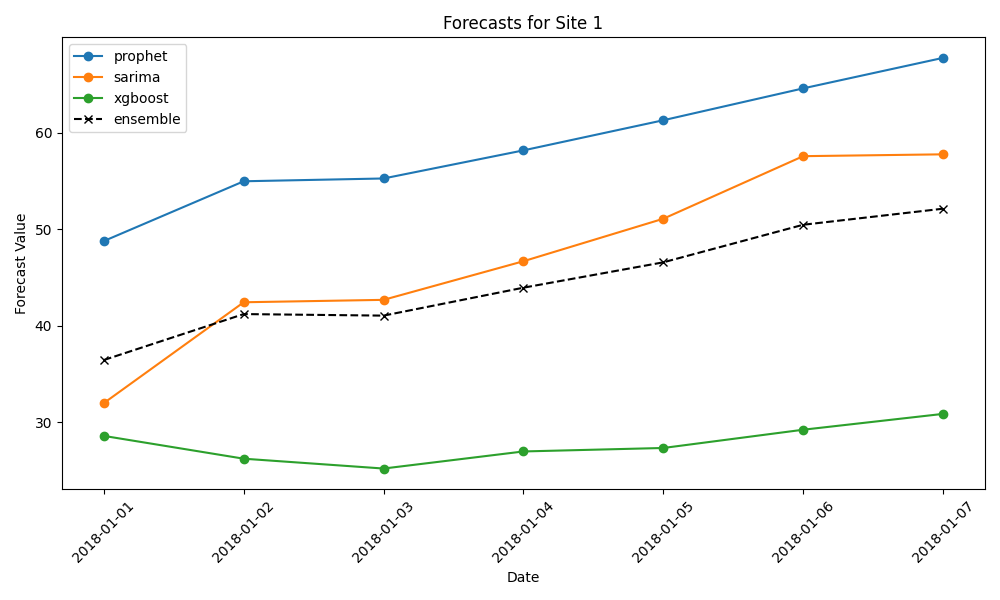

# SiteFlow Ensemble Engine


# SiteFlow Ensemble Engine

## Example Forecast Comparison



## Overview

SiteFlow Ensemble Engine is a polyglot forecasting system for construction sites, designed to showcase senior-level architecture and ensemble modeling. Built for Sitemate’s “Jack of all trades” requirement, it demonstrates how to combine Node.js, Go, and Python for scalable, maintainable, and extensible solutions.

## Features

- **Polyglot Architecture:** Node.js API Gateway, Go Orchestrator, Python Models.
- **Ensemble Modeling:** Combines Prophet, SARIMA, and XGBoost forecasts for robust predictions.
- **Concurrency:** Go orchestrator runs Python models in parallel for speed.
- **Extensibility:** Easily add new models or swap orchestration logic.
- **Demo-Ready Visualization:** Automatically generates and saves forecast comparison plots.

## Architecture

```
siteflow-ensemble-engine/
├── api-gateway/        # Node.js API Gateway
│   ├── server.js
│   └── package.json
├── orchestrator/       # Go Orchestrator
│   ├── main.go
│   ├── executor.go
│   └── aggregator.go
├── models/             # Python Models
│   ├── forecast_prophet.py
│   ├── forecast_sarima.py
│   ├── forecast_xgboost.py
│   ├── plot_ensemble_results.py
│   └── requirements.txt
├── data/               # Construction Data
│   └── site_materials_usage.csv
├── generated_forecasts/ # Saved forecast comparison images
│   └── forecast_comparisons_site_1_YYYYMMDD_HHMMSS.png
└── README.md
```

## How It Works

1. **User/API** sends a forecast request to Node.js (`/api-gateway`).
2. **Node.js** forwards the request to Go orchestrator (`/orchestrator`).
3. **Go** launches Python model workers in parallel (`/models`).
4. **Python** scripts run forecasts and return JSON.
5. **Go** aggregates results (ensemble logic) and returns to Node.js.
6. **Node.js** responds to the user.

## Quickstart

## Key Makefile Commands

Use these Makefile targets for a fast, repeatable workflow:

- **setup-all**: Sets up Python venv, installs Python dependencies, and Node.js dependencies for the API gateway.
	```powershell
	make setup-all
	```
- **run**: Runs the Go orchestrator (executes all models and ensemble logic).
	```powershell
	make run
	```
- **gateway**: Starts the Node.js API gateway server.
	```powershell
	make gateway
	```
- **plot**: Generates and saves the ensemble forecast comparison plot for site_id 1.
	```powershell
	make plot
	```

### 1. Install Python dependencies

```powershell
python -m venv venv
.\venv\Scripts\pip install -r models/requirements.txt
```

### 2. Run the Go orchestrator

```powershell
make run
```

### 3. Start the API Gateway

```powershell
cd api-gateway
npm install
node server.js
```

### 4. Request a forecast

```powershell
curl "http://localhost:3000/forecast?site_id=1"
```

### 5. Generate and view forecast comparison plot

```powershell
venv\Scripts\python models/plot_ensemble_results.py --site_id 1
```
Find the generated image in `generated_forecasts/`.

## Data Format Example

```
date,material,units_consumed,site_id
2024-01-01,cement,500,1
2024-01-02,cement,520,1
...
```

## Extending the System

- Add new Python models to `/models` and update Go orchestrator to include them.
- Refactor Python scripts into a microservice for production.
- Add OpenAPI docs to Node.js gateway for better API usability.

## Senior Engineer Defense

> “For this demo, I used shell execution for simplicity and isolation. In production, I’d refactor Python into a gRPC microservice, with Go sending protobuf messages to persistent Python workers—avoiding interpreter startup latency. This architecture demonstrates Go’s concurrency and is easy to deploy for a proof-of-concept.”

## License

MIT

